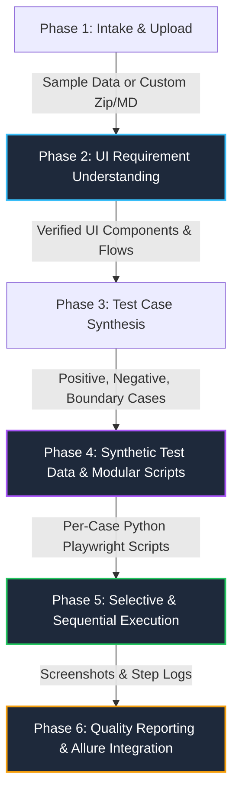

# Comprehensive Fixes, Architecture & Implementation Roadmap

This document serves as the master blueprint for all QET testing engine enhancements requested by the QA team.

---

## 1. Architectural Overview & Requirement Breakdown

---

## 2. Core Pillars of the Plan

### Pillar 1: UI Requirements Understanding & Analysis Accuracy
- **Refined Extraction**: Ensure the Requirement Analyzer explicitly parses UI elements, buttons, input fields, validations, and flows from the 8 reference documents.
- **Testing Type Separation**: "UI Testing" is active and primary; "API Testing", "Performance Testing", and "Accessibility Testing" are clearly badged as **Coming Soon**.
- **No Hallucinations**: Ground all selectors on actual source code files (`data-testid`, IDs, names, ARIA labels).

### Pillar 2: Case Selection, Synthetic Data & Modular Scripts
- **Dedicated Script per Test Case**: Every single test case (Positive, Negative, Boundary, Validation, Error Handling) generates its own standalone, executable Python Playwright file (`test_TC_xxx.py`).
- **AI-Powered Synthetic Data**: Realistic data generator producing matching records for positive flows and faulty/boundary records for negative flows.
- **Selection Controls in UI**:
  - `Select All` / `Select None (Clear)`
  - Filter by category (Positive, Negative, Boundary, etc.)
  - Multi-select checkboxes
  - Dynamic **"Proceed / Run Selected ({N})"** button.

### Pillar 3: Execution Engine & Screenshot Capture
- **Execution Modes**:
  - **Sequential (One-by-One)**: Watch each script launch, interact with elements, and record logs in real-time.
  - **Batch Run**: Run all selected scripts in order.
- **Automated Evidence Capture**:
  - Automatically captures full-page screenshot on **Success (Passed)** and **Failure (Failed/Error)**.
  - Links screenshots directly to the test case row with instant modal previews and zoom.
- **Live Console Logs**: Real-time Playwright terminal logs streaming during execution.

### Pillar 4: Allure & Rich Quality Reporting
- **Interactive Dashboard**:
  - Pass/Fail metrics, category distribution, duration breakdowns.
  - Allure-compatible metadata & JSON/HTML report export.
  - Embedded screenshot gallery with per-step breakdown.

### Pillar 5: Seamless Navigation & In-Lane Progression
- **Bottom Progression CTAs**: Every agent stage features a prominent "Next Step: Proceed to [Next Agent]" banner at the bottom of the content area.
- **Key Recovery UX**: Inline dismissible/collapsible API key entry for seamless key rotation and prompt-to-add on exhaustion.
