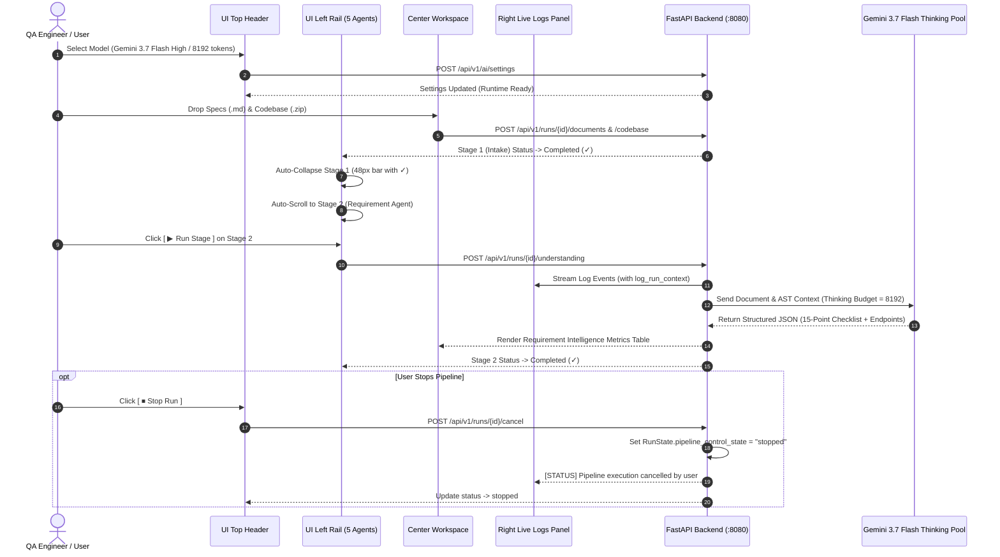

# Spec-Kit 020: Architectural Flow & State Transitions Plan

---

## 1. End-to-End Execution Flow

---

## 2. Left Rail State Progression Matrix

| Pipeline Stage | Initial State | Trigger Event | Active Subagents | Exit Transition Condition |
| :--- | :--- | :--- | :--- | :--- |
| **1. Intake Agent** | `pending` | Upload Document / ZIP | `Manifest Parser`, `Codebase Unpacker` | `intake_manifest` populated with file list |
| **2. Requirement Understanding Agent** | `pending` | Click `▶ Run Stage` | `Doc Parser`, `Context Analyzer`, `Requirement Categorizer` | `understanding_ready` emitted with 15-pt checklist |
| **3. Test Generation Agent** | `pending` | Auto/Manual Trigger | `Test Case Synthesizer`, `Synthetic Data Generator`, `Playwright Code Generator` | `test_cases` generated across 5 test types |
| **4. Execution Agent** | `pending` | Stage Trigger | `Playwright Runner`, `API Runner`, `Evidence Collector` | All Playwright tests executed with screenshots |
| **5. Quality Intelligence Agent** | `pending` | Stage Trigger | `Diagnostic Engine`, `Self-Correction Agent` | Executive report generated, PDF package ready |
