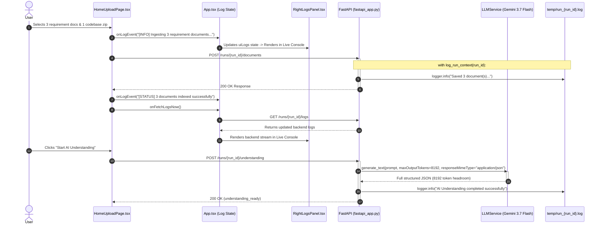

# Architectural Plan: Spec-Kit 021

## 1. Component Execution Sequence

---

## 2. Detailed File Modifications

### File 1: `backend/src/services/llm_service.py`
- Increase `AGENT_MODEL_POLICIES["understanding"].max_output_tokens` to `8192`.
- Add `"responseMimeType": "application/json"` to `_call_gemini_model`.
- Implement `_repair_truncated_json` helper in `parse_json_payload_with_diagnostics`.

### File 2: `backend/src/api/fastapi_app.py`
- In `upload_documents`: Wrap inside `with log_run_context(run_id):` and emit `logger.info()`.
- In `upload_codebase`: Wrap inside `with log_run_context(run_id):` and emit `logger.info()`.

### File 3: `src/App.tsx`
- Pass `onLogEvent={logUiEvent}` and `onFetchLogsNow={fetchLogsImmediately}` into `HomeUploadPage`.

### File 4: `src/components/HomeUploadPage.tsx`
- Call `onLogEvent` on file select, drop, upload start, upload success, and failure.
- Call `onFetchLogsNow` upon successful upload.
