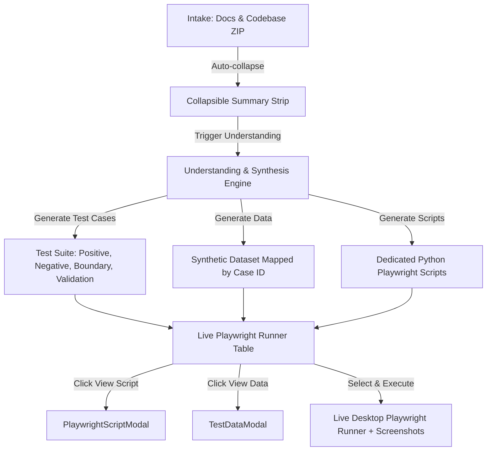

# Implementation Plan: Feature 022 — Test Case & Synthetic Data Intelligence, Script Visibility, and Selective Execution

## 1. Architectural Overview
This plan coordinates changes across the React frontend and FastAPI runtime layer to expose dedicated script viewers, test data inspectors, and selective execution capabilities.

---

## 2. Component Deliverables

### 2.1 Frontend Components
1. `src/components/HomeUploadPage.tsx`:
   - Auto-collapse completed upload lanes.
   - Streamline into single action CTA.
2. `src/components/execution/PlaywrightScriptModal.tsx`:
   - Dark theme syntax viewer for `test_tc_*.py` and `cfa_pages.py`.
   - Copy to clipboard & download script.
   - Discovered selectors & Page Objects inspector.
3. `src/components/execution/TestDataModal.tsx`:
   - Key-value mock dataset viewer.
   - Boundary value & negative payload highlight.
   - Copy JSON data.
4. `src/components/execution/LivePlaywrightRunner.tsx`:
   - Enhanced table with inline `[< /> Script]` and `[📊 Data]` buttons.
   - Checkbox multi-select and quick filters.
   - Live execution button for selected cases.
   - Screenshot preview thumbnails.
5. `src/types.ts`:
   - Add `SyntheticRecord` and `SyntheticDataset` interfaces.
   - Add extended fields to `TestCase` and `AppState`.

---

## 3. Backend Coordination
- `fastapi_app.py`:
  - Ensure `/runs/{run_id}` serves full AppState containing `test_suite`, `synthetic_dataset`, and `playwright_scripts`.
  - Serve per-script artifacts and live execution streaming.
