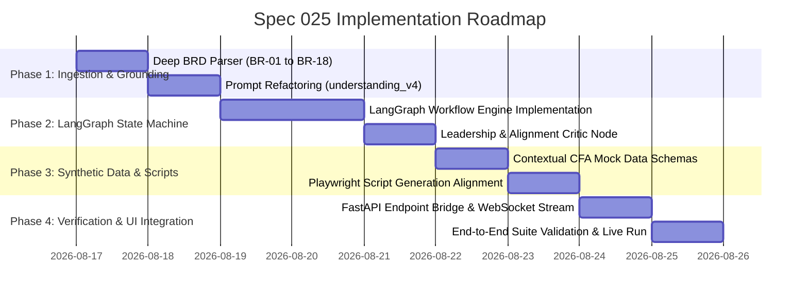

# Implementation Plan: Spec 025 — LangGraph Multi-Agent Architecture & Business Alignment Pipeline

## Phase Breakdown & Execution Milestones

---

## Phase 1: Requirement Grounding & Understanding Fix

### Objectives
- Ensure that the Understanding Agent extracts and stores complete requirement text and individual `BR-XX` items rather than just file names.
- Update `understanding_v3.py` &rarr; `understanding_v4.py` with explicit business grounding instructions.

### Deliverables
- [`backend/src/agents/understanding_agent.py`](file:///d:/TcsQET/qet-react-ui/backend/src/agents/understanding_agent.py): Ingest raw requirement document content (`requirement1.txt`), parse `BR-01` through `BR-18` line-by-line, and embed them into `AppState.understanding.requirements`.
- [`backend/src/prompts/understanding_v4.py`](file:///d:/TcsQET/qet-react-ui/backend/src/prompts/understanding_v4.py): Prioritize domain candidate journeys, user workflows, and business acceptance criteria over technical source code snippets.

---

## Phase 2: LangGraph Workflow Engine & Critic Guardrail

### Objectives
- Build the cyclic Multi-Agent Graph using LangGraph (with pure Python fallback for minimal dependencies).
- Add the `AlignmentCriticNode` that enforces zero framework leaks and 100% BRD coverage.

### Deliverables
- [`backend/src/workflows/langgraph_pipeline.py`](file:///d:/TcsQET/qet-react-ui/backend/src/workflows/langgraph_pipeline.py): Defines `GraphState`, nodes (`ingest`, `synthesize_test_cases`, `critique_alignment`, `synthesize_test_data`, `synthesize_scripts`), and conditional edges.
- [`backend/src/agents/alignment_critic_agent.py`](file:///d:/TcsQET/qet-react-ui/backend/src/agents/alignment_critic_agent.py): Evaluator that scans test cases for forbidden technical terms (`Streamlit`, `SQLite`, `pytest`) and verifies `requirement_id` mappings.

---

## Phase 3: Synthetic Test Data Alignment

### Objectives
- Align test data generation with candidate personas, KYC payloads, payment transactions, and exam answers.

### Deliverables
- [`backend/src/agents/test_data_agent.py`](file:///d:/TcsQET/qet-react-ui/backend/src/agents/test_data_agent.py): Produces structured JSON/CSV records matching candidate attributes rather than mock exception objects.
- Integration with UI `<TestDataModal />` to display live candidate mock attributes.

---

## Phase 4: UI Telemetry & Fast Execution

### Objectives
- Stream LangGraph node state transitions to the React front-end.
- Display `Alignment Score: 100%` badge in the UI header / Test Case Generator card.

### Deliverables
- WebSocket/SSE streaming of graph state and critic evaluations.
- Verification across Positive, Negative, Boundary, Validation, and Error-Handling filter tabs.
