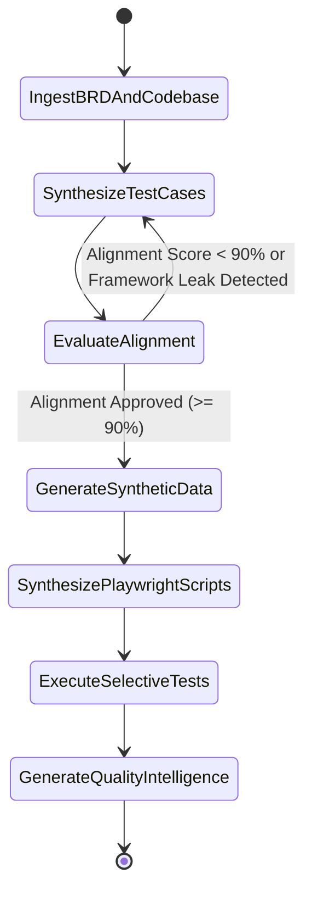

# Specification: Spec 025 — LangGraph Multi-Agent Architecture & Business Alignment Pipeline

## 1. Problem Statement & Background

### 1.1 The Alignment Dilemma
During autonomous test generation on the CFA Candidate Journey application, the agent suite synthesized test cases focused heavily on internal software framework artifacts rather than candidate-facing business journeys:
- Generated tests targeted: *Streamlit session state payload limits, SQLite file permission errors, Python backend exception propagation, and generic data-testid attributes.*
- Omitted core business domains: *Candidate Self-Registration & KYC (`BR-01, BR-02`), CFA Level I/II/III Discovery & Fee Payment (`BR-03, BR-04`), Timed Mock Exams (`BR-08`), Exam Slot Booking (`BR-09`), Remote AI Proctoring (`BR-10`), Score Band Reporting (`BR-11`), and Digital Credentialing (`BR-12`).*

### 1.2 Root Cause Analysis
1. **Shallow Document Ingestion**: The Step 1 Understanding Agent received only the *file names* of requirement documents (e.g. `['requirement1.txt']`) while ingesting the full code repository snapshot.
2. **Framework Bias in AI Inference**: Without full parsed BRD text, the LLM inferred that the application's primary identity was its technical plumbing (Python/Streamlit/SQLite), generating technical unit/plumbing test cases.
3. **Absence of a Verification Guardrail**: The sequential pipeline lacked an autonomous **Critic / Alignment Node** capable of validating test cases against business criteria before proceeding to synthetic data generation.

---

## 2. Business Requirements Reference (CFA Candidate Journey BRD)

Every generated test case, synthetic mock record, and Playwright execution script must ground itself strictly in the 18 requirements from `requirement1.txt`:

| Req ID | Requirement Name | Core Functional Scope & Acceptance Criteria |
| :--- | :--- | :--- |
| **BR-01** | Candidate Registration & Onboarding | Web/mobile self-registration, SSO/email login, guided onboarding, dashboard provisioned in <3s. |
| **BR-02** | Identity Verification & KYC | Government ID and biometric/liveness check, auditable verification status, manual review routing. |
| **BR-03** | Program & Exam Discovery | Level I/II/III curriculum details, prerequisites, fees, eligibility validation, real-time exam windows. |
| **BR-04** | Enrollment & Fee Payment | Multiple payment methods (card, net-banking), PCI-DSS gateway, instant receipt, dashboard update. |
| **BR-05** | AI-Driven Personalized Learning | Level-appropriate study path, adaptive study schedule based on target exam date and hours/week. |
| **BR-06** | Digital Learning Content & LMS | Topic/reading/LOS organization, web/mobile tracking, completion & time-on-content metrics. |
| **BR-07** | AI Study Assistant / Tutor | Curriculum-grounded Q&A, topic citations, practice question generation on demand. |
| **BR-08** | Practice Tests & Mock Exams | Timed mock exams matching real difficulty, automated scoring, topic-level performance breakdown. |
| **BR-09** | Exam Slot Scheduling | Real-time center & remote appointment booking, reschedule/cancellation policy rules, calendar sync. |
| **BR-10** | Secure Exam Delivery & Proctoring | Pre-exam identity re-verification, AI real-time proctoring integrity detection, end-to-end encryption. |
| **BR-11** | Results Processing & Reporting | Results within SLA, score report with pass/fail and topic percentiles, downloadable PDF report. |
| **BR-12** | Digital Certification & Credentialing | Tamper-proof verifiable digital badge, one-click LinkedIn sharing, third-party verification link. |
| **BR-13** | Progress & Analytics Dashboard | Readiness indicators, mock score trends, strengths/gaps analytics, real-time metric updates. |
| **BR-14** | Notifications & Communication | Automated reminders for deadlines/exams via email/SMS/push, preference center. |
| **BR-15** | Support & Chatbot Assistance | AI chatbot for common queries, human escalation with context handover, ticket tracking. |
| **BR-16** | Accessibility & Inclusion | WCAG 2.1 AA compliance, accommodations request (extra time, assistive tech), multi-locale. |
| **BR-17** | Data Privacy & Security | PII encryption in transit & rest, GDPR compliance, audited consent & retention policies. |
| **BR-18** | Platform Reliability & Scalability | Auto-scaling during peak enrollment, ≥99.9% uptime, seamless fault recovery. |

---

## 3. LangGraph Multi-Agent Graph Architecture

The workflow is modeled as a cyclic state graph in `backend/src/workflows/langgraph_pipeline.py`.

### 3.1 Graph Nodes & Responsibilities

#### Node 1: `IngestBRDAndCodebase` (Understanding Agent)
- **Input**: Uploaded requirement files (`.txt`, `.pdf`, `.docx`, `.md`) + Codebase repository.
- **Action**: 
  - Extracts full text of `BR-01` through `BR-18` into structured `RequirementItem` entities.
  - Inspects code repository for UI routes, forms, controls, and API contracts.
  - Produces `ApplicationUnderstanding` object with 100% requirement coverage.

#### Node 2: `SynthesizeTestCases` (Test Case Generation Agent)
- **Input**: Parsed BRD requirements + UI component inventory.
- **Action**: Generates 12+ test cases strictly distributed across the **5 Core Test Types**:
  1. **Positive (POS)**: Happy path candidate flows (Onboarding, Payment, Mock Exam, Badge).
  2. **Negative (NEG)**: Invalid inputs, expired KYC passport, declined payment card.
  3. **Boundary (BND)**: Cutoff time booking at T-0, timed exam auto-submit at 00:00.
  4. **Validation (VAL)**: Email regex, password complexity, topic percentile scoring rubrics.
  5. **Error-Handling (ERR)**: Proctoring video feed interruption, payment gateway timeout retry.

#### Node 3: `EvaluateAlignment` (Leadership & Alignment Critic Node)
- **Input**: Synthesized test cases + BRD requirement catalog.
- **Rules**:
  - Rejects any test mentioning internal library names (`Streamlit`, `SQLite`, `pytest internals`, `BaseAgent`).
  - Verifies that at least 80% of test cases trace directly to a valid `BR-XX` requirement ID.
  - Computes `alignment_score` (0.0 to 1.0). If `< 0.90`, provides feedback and routes back to Node 2.

#### Node 4: `GenerateSyntheticData` (Data Generation Agent)
- **Input**: Approved business test cases.
- **Action**: Synthesizes realistic, domain-specific mock data records:
  - *Candidate Persona*: Full Name, Email, DOB, Country, CFA Level.
  - *KYC Payload*: Passport ID, Expiry Date, Liveness Score, Document Image Mock.
  - *Payment Payload*: Card Number (Luhn-compliant test PAN), Expiry, CVV, Billing Address.
  - *Exam Session*: Slot ID, Exam Window, Duration Minutes, Question Response Array.

#### Node 5: `SynthesizePlaywrightScripts` (Script Synthesis Agent)
- **Input**: Test cases + Synthetic data schemas + Discovered UI selectors.
- **Action**: Generates executable Python Playwright scripts (`tests/test_tc_*.py`) with explicit asserts, data-testid targeting, and screenshot capture triggers.

#### Node 6: `ExecuteSelectiveTests` & `GenerateQualityIntelligence`
- **Action**: Runs selected tests in live desktop browser or headless mode, tracks execution telemetry, and generates quality metrics.

---

## 4. UI & Telemetry Contract

1. **Left Rail Agent Hierarchy**:
   - `Agent 1: Application Understanding`
   - `Agent 2: Test Case Generation`
   - `Agent 3: Test Data Generation`
   - `Agent 4: Test Script Generation`
   - `Agent 5: Test Execution & Monitoring`
   - `Agent 6: Analytics & Quality Intelligence`
2. **Interactive Critic Feedback Badge**:
   - Displays real-time validation indicator: `🟢 100% BRD Aligned (0 Framework Leaks)`.
   - On the Test Case view, each case displays its linked `Requirement: BR-XX` pill.
3. **Data Inspector Modal**:
   - Shows candidate mock records matching the exact schema required for each test case.
